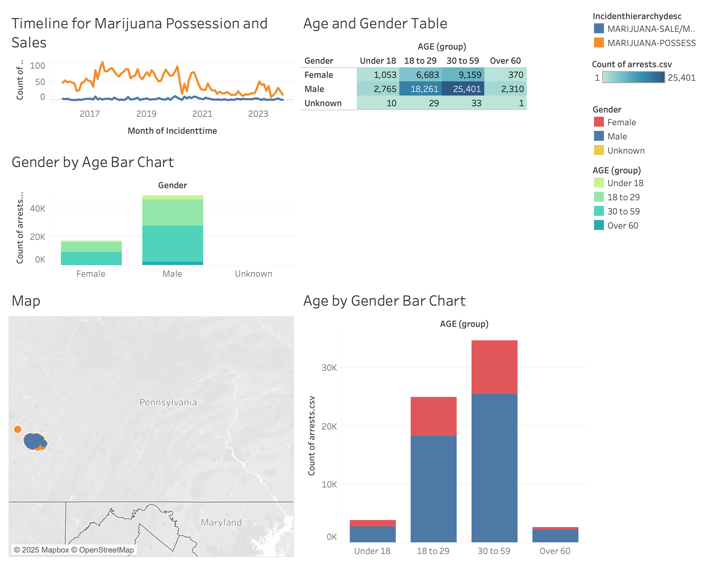

## Tableau In-Class Exercises Instruction
### Getting Started with Tableau
1. First, download the Tableau Public desktop: `https://www.tableau.com/products/public/download`
1. You will also need a Tableau public account. You can sign up here: `https://www.tableau.com/community/public/get-started`

### Datasets
Data for the in-class exercises can be downloaded from Western PA Regional Data Center. Download the `.csv` files for each of the following and save them to your desktop:

		Dataset 1: Public Blotter Data
		https://data.wprdc.org/dataset/police-incident-blotter
		
		Dataset 2: Pittsburgh Police Arrest Data:
		https://data.wprdc.org/dataset/arrest-data
		
### Sample output dashboard (see below)

