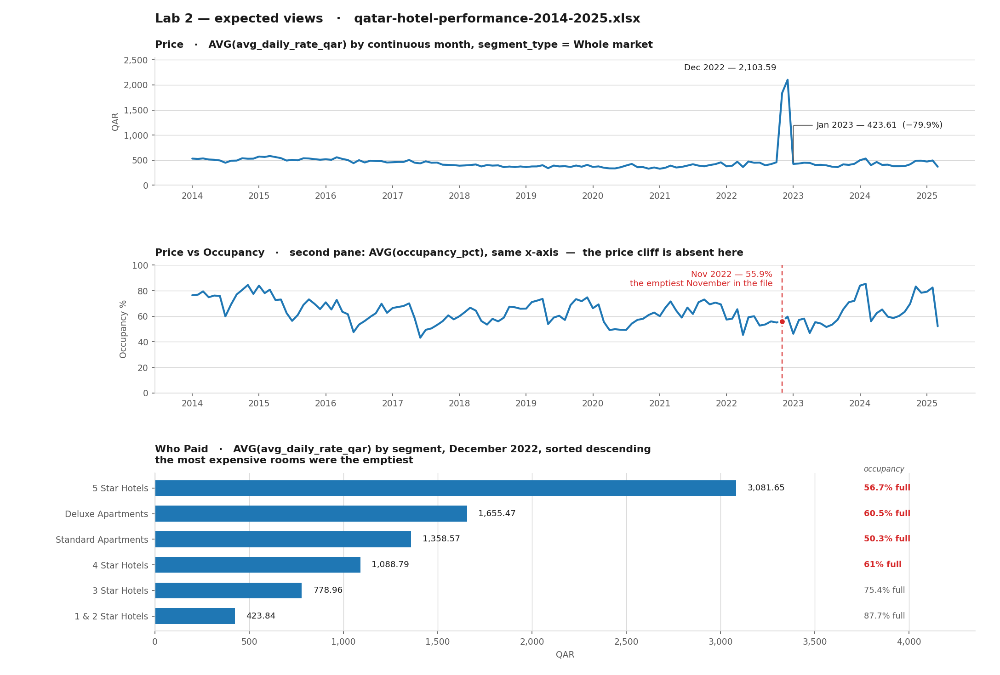
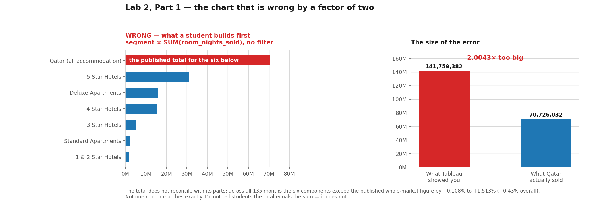

# Expected deliverable & TA notes — Lab 2: Tableau

**67-290 · Saturday 31 October 2026 · 1:00–2:30pm, in person · 5 points**

Everything here was derived by opening the two data files and recomputing every figure. Tableau feature
availability was checked against Tableau's own web-authoring documentation, not assumed.

---

## What correct looks like

*Rendered directly from `data/qatar-hotel-performance-2014-2025.xlsx` — every value above is in the file. A
student's Tableau screen will differ in styling (Tableau's own fonts, default blue, its tooltips) but the
**shapes and the numbers must match**.*

And the chart every student builds in Part 1, before they filter:

> **This is the fastest way to grade.** If a student's bar chart still has seven bars, or any total near
> 141 million, the `segment_type` filter is missing and everything downstream is doubled.

---

## What a finished student has

1. **A published Tableau Public viz** at a working URL — a dashboard or a story, built from
   `qatar-hotel-performance-2014-2025.xlsx`, containing at least two of:
   - `Price` — AVG(avg_daily_rate_qar) over continuous `month`
   - `Price vs Occupancy` — the same, with AVG(occupancy_pct) as a second pane
   - `Who Paid` — AVG(avg_daily_rate_qar) by `segment`, Dec 2022, sorted descending
2. **At least one shown filter** that works when the URL is opened in a fresh tab.
3. **The `segment_type` filter applied** — the single thing that separates a correct viz from a doubled one.
4. **One sentence** naming something the chart cannot tell the reader.

---

## Grading · 5 points

| | |
|---|---|
| 2 | Published viz at a working URL, ≥ 2 views |
| 1 | ≥ 1 shown filter, demonstrably working in a fresh tab |
| 1 | `segment_type` filtered — numbers not doubled |
| 1 | The sentence naming what the chart cannot say |

**Participation-shaped.** A student who hit a wall, said so, and showed a TA what they tried keeps full marks.

### How to grade it in 60 seconds, with no software

Open the URL. Check: does it load · are there filter controls on the right · click one, does the chart change ·
does the y-axis sit in the hundreds-to-thousands of QAR (correct) rather than the tens of thousands (unfiltered,
doubled).

**The doubling tell:** if `SUM(room_nights_sold)` appears anywhere near 141 million, the `segment_type` filter is
missing. The truth is 70,726,032.

---

## The 90 minutes

| Min | Part | What happens | Can it be cut? |
|---|---|---|---|
| 0–8 | Setup | Sign in · set profile hidden · upload hotel file | No |
| 8–14 | **The wrong chart** | `segment` × `room_nights_sold` → the 2.0043× double count → the filter | No — it's the thesis |
| 14–26 | The price | `month` blue→green · `SUM`→`AVG` · the 4.6× spike | No |
| 26–34 | The emptiness | occupancy as a second pane · Nov 2022 is the emptiest November | No — it's the payoff |
| 34–42 | Who paid | by `segment`, Dec 2022 · 5-star empty, 1&2-star full | Shorten to a demo if behind |
| 42–54 | Interactive | Show Filter ×2 | **No — Project 2 is graded on this** |
| 54–63 | Dashboard + Story | Assemble; name the objects | Shorten to a demo if behind |
| 63–72 | **Publish + fresh tab** | Save publishes · open in new tab · click own filters | **Never cut** |
| 72–85 | The mess | Museum file: type fix · two kinds of missing · group the spellings | **Cut this first** if behind |
| 85–90 | Submit · P2 handoff | Canvas · dataset sign-up | No |

> ### ⚠️ Three independent reviewers re-budgeted this at beginner pace and all three said 90 minutes is optimistic
> Their estimates landed between **110 and 130 minutes** for the full nine parts. Every novel drag costs a
> beginner 45–90 seconds, every modal dialog about a minute, and the class runs *after* a 90-minute morning
> lecture and a lunch break. **Plan to finish at Part 7 and hand Part 8 out as a take-home.** The run sheet is
> ordered so that costs you nothing load-bearing. Do not try to rescue Part 8 by compressing Parts 5–7.

**The ordering is deliberate.** Publishing and verifying interactivity is what Project 2 is graded on, so it sits
*before* the defect drill. If the room runs 15 minutes slow, Part 8 becomes a take-home and nothing load-bearing
is lost.

### The two STOP checkpoints

1. **After the `segment_type` filter** (minute ~14). Everything downstream is wrong without it.
2. **After publishing + opening in a fresh tab** (minute ~72). This is the one that matters. A student who
   reaches here can do Project 2.

---

## TA prep — before 31 October

| | |
|---|---|
| ☐ | **Post the pre-class task on Canvas by Monday 26 October** — it is the *"Before you walk in"* section at the top of [`../Lab2-Tableau.ipynb`](../Lab2-Tableau.ipynb). Paste it into an announcement; do not assume students open the notebook a week early. The Tableau account requirement otherwise lives only in TA-facing notes and reaches no student. |
| ☐ | **Collect Tableau Public usernames** on Canvas so failed signups surface on the Monday, not the Saturday. |
| ☐ | **Ask what laptop and OS each student is bringing.** You are looking for the iPad-only student — they cannot author at all and need a loaner. |
| ☐ | **Make 2–3 spare Tableau Public accounts.** Someone will arrive without one. |
| ☐ | **Run the whole lab yourself, in a browser, start to finish.** Tableau's web-authoring UI moves. Check the date-pill menu still shows discrete-blue above continuous-green, and that the **Group Members (📎)** control still appears on marks selection. |
| ☐ | **Verify the Canvas dataset sign-up sheet is live** before the lab ends — Project 2 goes out the same day, capped at 4 students per dataset. |

---

## Verified platform facts

All confirmed against Tableau's own documentation. Everything the lab asks for **is supported in browser web
authoring**: change a field's data type · create groups from selected marks · create calculated fields · change
aggregation · show and hide filter cards · create dashboards and stories · rename and sort fields · create bins
and hierarchies · upload `.xlsx`.

| | |
|---|---|
| Accepted uploads | `.xlsx`, `.csv`, `.tsv` only, 1 GB max. **No GeoJSON** — spatial files need Desktop Public Edition. |
| Saving | **File → Save publishes.** No local save in the browser. |
| **Filter cards** | **Automatic.** *"In web authoring, interactive filters are automatically added to the view when you drag a field to the Filters shelf."* There is no *Show Filter* step — the browser-specific skill is **hiding** cards you do not want published. |
| **Getting the link** | *"display a view, and then click **Share at the bottom of the view**."* The editor's address bar holds an **`/authoring/`** URL that reopens the editor and proves nothing. |
| Mobile | **Authoring on any mobile device is unsupported.** Chromebook is fine; iPad is not. |
| Qatar geocoding | Airport (2), City (5), Municipality-as-State/Province (7). **No geocoding for the 91 zones**, no postcodes. |
| Eastern-Arabic numerals | Import as text and **cannot** be coerced. Neither lab file contains any — verified. |

**There is no map in this lab.** Tableau's browser editor cannot load the GeoJSON in `data-sources/geo/`, and
Lab 3 is an entire ArcGIS mapping lab nine days later. Maps belong there.

---

## Failure modes

| Symptom | Cause | Fix |
|---|---|---|
| Numbers ~2× too big | `segment_type` unfiltered — the total is inside the parts | Filter to `Whole market` |
| Four fat bars, not a time line | Blue discrete `YEAR(month)` | Pill → **Month** from the lower green block |
| Impossible prices | Default `SUM` on a ratio | Pill → Measure → Average |
| Right-click does nothing | Browser context menu | Use the **▾** on the pill's right edge |
| Link reopens the editor | Copied an `/authoring/` URL from the address bar | Leave the editor → published view → **Share** → Copy Link |
| Unexplained panel on the right | The browser auto-adds a card for every filter | Expected. Hide via card **▾** → untick Show Filter |
| A grader can break the chart | `segment_type` card left visible and switched to `Hotel segment` | Hide that card before the final Save |
| Can't save anything | Email never confirmed | Spare account |
| `number` under Dimensions | 95 text cells in a numeric column | **Abc** icon → Number (whole) |
| Student on an iPad | Unsupported by Tableau | Loaner laptop |

---

## Open questions for the instructor

1. **The lab's name.** Both CSVs call it *"Tableau **and Integration in Observable Dashboard**."* The embed is now
   an optional take-home ([`../TAKE-HOME-embed-in-observable.md`](../TAKE-HOME-embed-in-observable.md)), so either
   keep the title and point at the take-home, or rename the lab in the schedule and grading CSVs. Do not leave
   them disagreeing.
2. **Lab numbering.** The folder is `lab2`, but both CSVs still label this lab **Lab 1** and the whole set runs
   0–3 rather than 1–4. The CSVs need renumbering to match the folders.
3. **Museum file on the Project 2 menu.** It is dataset #7. The lab uses it for a defect drill only and never
   builds its story, so it can stay — but the menu entry should say the `number` column was fixed in class.

---

## Post-review corrections (2 October)

An independent 14-agent design review re-derived every figure from the files and checked every interaction
against Tableau's own documentation. It confirmed all the data work and found four errors in the first draft of
this lab, **all now fixed**:

| Found | Status |
|---|---|
| The lab said *"right-click → Show Filter"*. In **browser** web authoring, filter cards are added **automatically**; that menu step is Desktop idiom and would have had 25 students hunting for an item that is not offered — in the one block declared uncuttable. | Fixed. Part 5 is rewritten around *tuning and hiding* cards, which is the genuine browser skill. |
| The lab said to copy the URL **from the address bar**. That is an `/authoring/` link that reopens the editor for the author only. | Fixed. Part 7 now routes through the published view → **Share** → Copy Link. |
| The lab filtered on the **`year`** column. It is stored as a whole number, so Tableau files it under *Measures* and gives a slider, not a tick-list. | Fixed. Part 5 filters on `month` → Years, and uses the mistake to re-teach the type lesson. |
| The lab said dragging `month` gives *"four fat bars"*. The file spans 2014–2025, so it gives **twelve**. | Fixed. |

It also surfaced three data facts now documented in [`../data/PROVENANCE.md`](../data/PROVENANCE.md):
**the total does not reconcile with its parts** (zero of 135 months match; −0.108% to +1.513%), **three rows have
occupancy above 100%** (all 1&2 Star: 100.3, 102.0, 102.8), and **2025 holds only Jan–Mar**, so any SUM-by-year
chart shows a fake 75% cliff that is really 3 months against 12.
