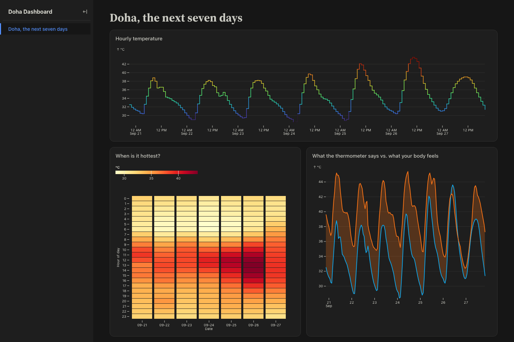

# Expected deliverable — Lab 0: Under the Hood

**67-290 · Wednesday 28 October 2026 · 5 points**

What a student who follows [`../Lab0-Under-the-Hood.ipynb`](../Lab0-Under-the-Hood.ipynb) ends up with.
Everything here was produced by actually running the notebook's instructions end to end, not written by hand.



*Rendered from a clean-room run. Colours follow the viewer's system light/dark setting; the chart values
will differ on the day, because the data is live.*

---

## 1. The repo: `doha-dashboard` (private)

Eight tracked files. `node_modules/` and `dist/` are excluded by the project's `.gitignore` — if you see
either in a student's repo, they deleted or ignored the `.gitignore`.

```
.gitignore
observablehq.config.js
package-lock.json
package.json
src/.gitignore
src/data/doha.json.js     <- student pastes this (Step 7)
src/doha.md               <- student builds this (Steps 5, 7, 8, 9)
src/index.md
```

Only the two marked files are student-authored. Copies are in [`src/`](src/) for comparison.

## 2. The history: exactly 5 commits

```
Restore Doha coordinates                      <- Step 11, via git checkout
Point the dashboard at Pittsburgh             <- Step 10
Three charts in a dashboard layout            <- Step 9
Add data loader pulling live Doha forecast    <- Step 7
Observable app skeleton with a Doha page      <- Step 6
```

**This history is the main thing to grade.** It shows the whole session: they built it, broke it on purpose,
and recovered it with version control rather than by retyping. Commit *messages* may differ — the five
*states* should not.

A quick check that the restore was real rather than retyped:

```
git show --stat HEAD          # touches only src/data/doha.json.js
git log --oneline | wc -l     # 5
```

## 3. The page: three charts, two grids

- **Hourly temperature** — `Plot.lineY`, rainbow stroke, seven daily cycles
- **When is it hottest?** — `Plot.cell`, 7 columns × 24 rows = 168 tiles, hover tooltips
- **Thermometer vs. body** — `Plot.areaY` band between `temperature` and `feelsLike`, plus two lines

Two separate `<div class="grid">` blocks, not one. A single grid forces all cards to equal height and leaves
a lake of empty space under the line chart — the notebook explains why in Step 9.

## 4. Written answer

> *Looking at chart 3, which number would you put in a public heat warning for Doha — the thermometer or the
> "feels like"? Why?*

There is no right answer; both numbers are real measurements. Credit the reasoning. A strong answer names a
reader ("someone scheduling outdoor work") and accepts a cost ("'feels like' is less comparable across
years"). A weak answer just says one is "more accurate".

---

## Grading (5 points)

| | |
|---|---|
| 2 | Repo exists, private, TAs added, dashboard renders |
| 2 | Five commits including the restore |
| 1 | Written answer engages with the two-numbers problem |

Participation-based: a student who hit a wall, said so, and showed what they tried keeps full marks.

## Failure modes seen while testing

| Symptom | Cause |
|---|---|
| Page blank, red error in the `npm run dev` terminal | Loader path ≠ `FileAttachment` path. Must be `src/data/doha.json.js`. |
| Every chart appears twice | Step 9's "delete the three `display(...)` lines" was skipped. |
| Huge empty space under the line chart | One grid instead of two. |
| `fetch failed: 404` from the loader | Coordinates malformed — check the minus sign on Pittsburgh's longitude. |
| `remote: Repository not found` | Typo in the remote URL. `git remote -v`, then `git remote remove origin` and retry. |
| `git checkout` restores nothing | Hash copied from the wrong commit; it must be *Three charts in a dashboard layout*. |

## Reproducing this

```
npx @observablehq/framework@latest create    # ./doha-dashboard, no samples, npm, no git
cd doha-dashboard && npm install && npm run dev
```

Verified 21 September 2026 against Observable Framework 1.13.4 and Node 22+. The Open-Meteo forecast endpoint
needs no account and no API key; it returned HTTP 200 and 168 hourly rows for both Doha and Pittsburgh.
